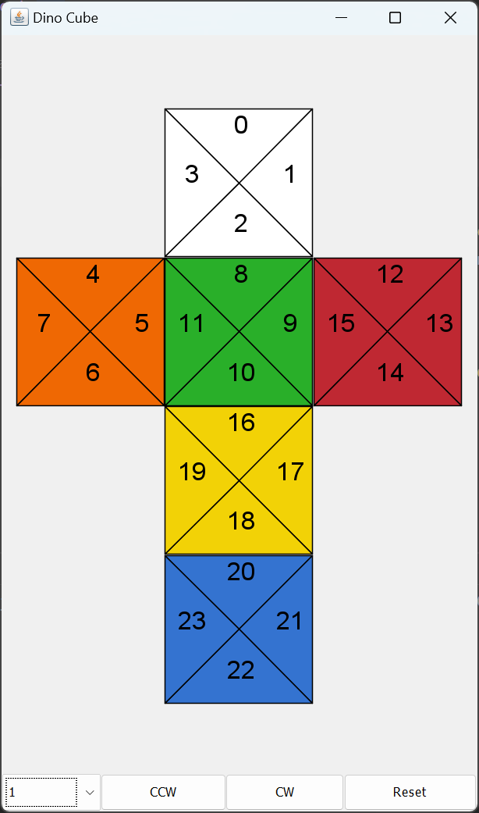

# Dino Cube
This is a simple application designed to simulate a flattened version of a Dino Cube, which is a cubic puzzle in the
style of the classic Rubik's Cube.

The cube is divided into 8 sections which can be turned clockwise or counterclockwise through the buttons in the bottom
part of the window. There is also a reset button which returns the cube to its initial state.